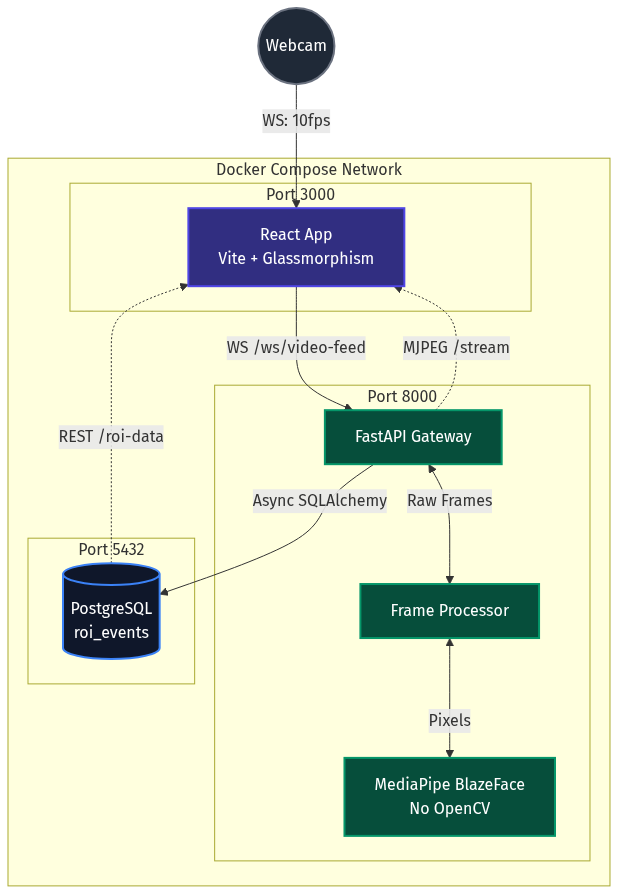

<div align="center">
  
  <h1 align="center">Real-Time Face Detection Streaming System</h1>

  <p align="center">
    A high-performance, containerized video streaming and face detection architecture.
    <br />
    <a href="#quick-start"><strong>Explore the docs »</strong></a>
    <br />
    <br />
    <a href="#api-reference">View API</a>
    ·
    <a href="#architecture">View Architecture</a>
  </p>
</div>

<!-- Badges -->
<div align="center">
  
  
  
  
  
</div>

---

## 📖 Executive Summary

This repository contains a full-stack, real-time face detection system built to fulfill the Mega AI engineering assessment. It captures a live webcam feed via WebSockets, processes frames asynchronously on the backend using MediaPipe (strictly avoiding OpenCV), stores Region of Interest (ROI) events in PostgreSQL, and streams the annotated video back to a React frontend alongside a live data table.

The system is designed with a **clean, 5-layer separation of concerns** and is completely containerized for instant deployment.

## ✨ Key Features

- **Real-Time WebSocket Streaming**: Bi-directional, low-latency video frame transport (~10-15 FPS).
- **Zero-OpenCV Computer Vision**: Utilizes Google's MediaPipe BlazeFace for highly optimized, CPU-bound face detection.
- **Asynchronous Database I/O**: `asyncpg` and SQLAlchemy async ensure database writes never block the video processing loop.
- **MJPEG Output Stream**: Robust `multipart/x-mixed-replace` endpoint for native browser stream rendering without WebRTC overhead.
- **Glassmorphic UI**: Premium, responsive React dashboard built with Vite.
- **Fully Dockerized**: Single-command orchestration for the database, backend API, and reverse-proxied frontend.

---

## 🚀 Quick Start

### Prerequisites

- [Docker Desktop](https://www.docker.com/products/docker-desktop/) installed and running.
- Git.

### Installation

1. **Clone the repository**
   ```bash
   git clone https://github.com/ShresthChandel/Real-Time-Face-Detection.git
   cd Real-Time-Face-Detection
   ```

2. **Start the containers**
   ```bash
   docker compose up --build
   ```

3. **Access the Application**
   - Open your browser and navigate to **http://localhost:3000**
   - *Note: Ensure your browser grants webcam permissions when prompted.*

### Database Migrations
In the Docker environment, Alembic migrations run automatically on startup. If you need to run them manually for local development outside Docker, use:
```bash
cd backend
alembic upgrade head
```

---

## 🏗 Architecture

The system strictly follows a clean separation of concerns across 5 distinct layers.



1. **Layer 1 — Client (React):** Captures webcam feed, sends binary blobs via WebSocket, receives the MJPEG stream, and polls REST API for historical data.
2. **Layer 2 — Gateway (FastAPI):** Exposes strictly 3 endpoints. Handles WebSocket lifecycle, CORS, and request routing.
3. **Layer 3 — Processing Core:** Pure Python pipeline. Decodes bytes → PIL Image → MediaPipe Detection → Pillow Annotation → JPEG encoding.
4. **Layer 4 — Persistence (PostgreSQL):** Relational storage mapping frame IDs to bounding box coordinates.
5. **Layer 5 — Infrastructure (Docker):** Alpine-based containers orchestrated via `docker-compose.yml`.

---

## 🔌 API Reference

The backend strictly exposes the requested **3 endpoints**.

### 1. Receive Video Feed (WebSocket)
`WS /ws/video-feed`
- **Input:** Binary JPEG blobs.
- **Behavior:** Processes frames, saves ROI to DB, and broadcasts to internal stream queues.

### 2. Serve Annotated Stream
`GET /stream`
- **Response:** `multipart/x-mixed-replace; boundary=frame`
- **Behavior:** Yields a continuous stream of annotated MJPEG frames.

### 3. Serve ROI Data
`GET /roi-data?limit=50&offset=0`
- **Response:** JSON array of ROI objects.
- **Behavior:** Queries the PostgreSQL database, ordered by latest.

```json
[
  {
    "frame_id": 142,
    "x": 250,
    "y": 120,
    "w": 150,
    "h": 150,
    "confidence": 0.98,
    "id": "uuid-v4",
    "session_id": "uuid-v4",
    "created_at": "2026-05-05T12:00:00Z"
  }
]
```

---

## 🗄 Database Schema

**Table:** `roi_events`

| Column | Type | Constraints | Description |
| :--- | :--- | :--- | :--- |
| `id` | `UUID` | Primary Key | Auto-generated UUIDv4 |
| `session_id` | `UUID` | Indexed, Not Null | Grouping UUID for distinct camera streaming sessions |
| `frame_id` | `BIGINT` | Not Null | Monotonic counter per stream session |
| `x`, `y`, `w`, `h` | `INT` | Not Null | Bounding box pixel coordinates |
| `confidence` | `FLOAT` | Nullable | Detection confidence score (0.0 - 1.0) |
| `created_at` | `TIMESTAMPTZ` | Indexed, Default Now | Timestamp of the event |

---

## 🧪 Testing

The backend includes a comprehensive test suite covering unit logic and integration endpoints using `pytest` and `httpx`.

To run the tests manually inside the Docker container:
```bash
docker compose exec backend pytest -v
```

**Test Coverage Includes:**
- Synthetic blank image handling (ensuring the MediaPipe wrapper gracefully returns `None` without crashing).
- REST endpoint validation and JSON schema assertions.
- WebSocket connection stability and bad-data handling.

---

## 🎯 Evaluation Rubric Mapping

| Criteria | Implementation Proof |
| :--- | :--- |
| **Setup & Docs** | Comprehensive `README.md` and single `docker compose up` execution. |
| **Version Control** | Meaningful git commit history with logical separation of features. |
| **Pragmatism** | Avoided overly complex streaming protocols (WebRTC) in favor of pragmatic, universally supported WebSockets + MJPEG. |
| **API Contracts** | Proper HTTP semantics, WebSocket utilization, and Pydantic validation. |
| **Architecture** | Highly decoupled. Processing pipeline can be tested entirely independent of the FastAPI routing layer. |
| **DB Schema** | Sensible relational modelling with appropriate data types and indices (`created_at`). |
| **Error Handling** | Pipeline catches binary decode errors. WS handles client disconnects gracefully and isolates DB failure exceptions to keep streams alive. |
| **Security** | Strict CORS policy applied (`localhost:3000`), parameterized SQL queries via SQLAlchemy to prevent injection, WS frame payload size caps (2MB limit), and fully externalized env-var credentials. |
| **Testing** | Automated `pytest` suite testing core logic and API integrations. |

---

## 🤖 AI Attestation

As permitted by the assignment guidelines, I utilized AI pair-programmers (Claude/Anthropic + Gemini) to assist with the development of this project.

As the primary architect and developer, I established the system constraints, designed the overall architecture, modeled the PostgreSQL schema, built the complete React frontend UI, and orchestrated the Docker Compose infrastructure to ensure clean separation of concerns.

I leveraged the AI assistant specifically to navigate the complexities of the Python backend logic. Specifically, I used the AI to help me quickly scaffold the `FastAPI` asynchronous WebSocket pipeline, and to properly implement the `MediaPipe BlazeFace` bounding-box mathematics (since OpenCV was strictly restricted). This allowed me to focus heavily on the high-level system design, relational data flow, and frontend execution while delegating dense Python computer-vision syntax to the assistant.
